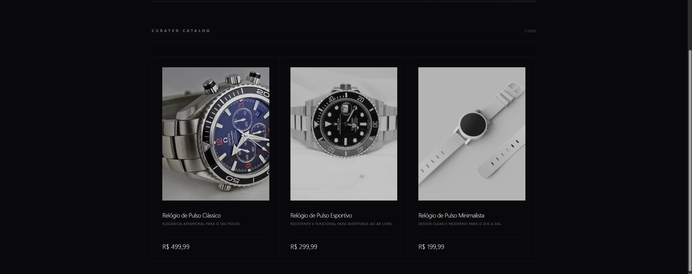
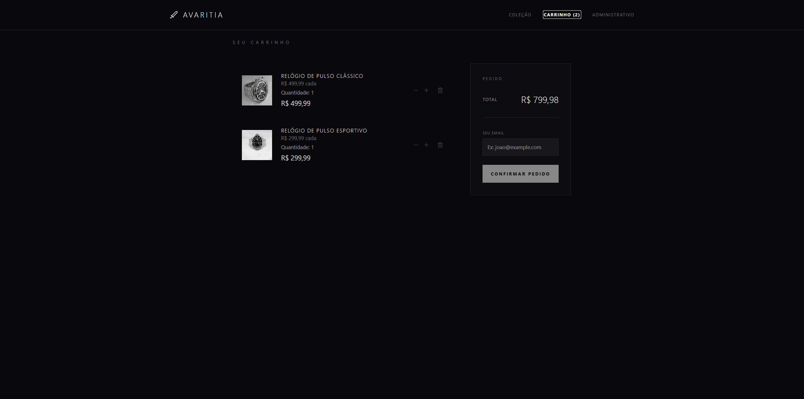
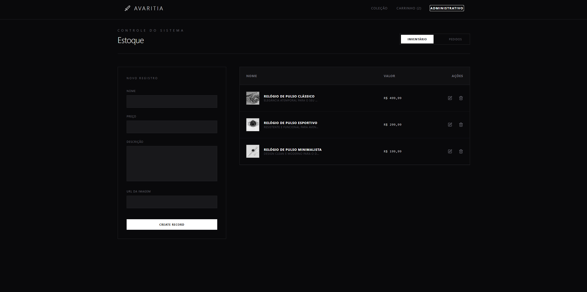
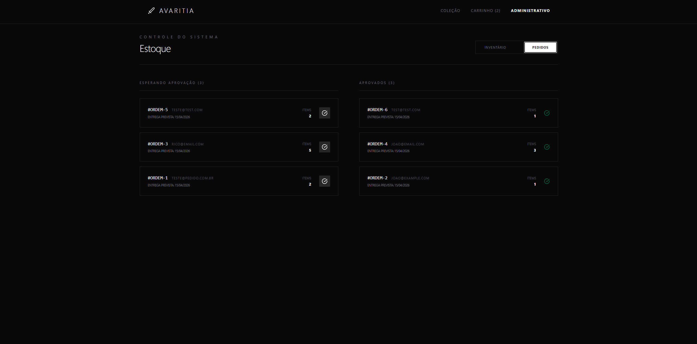

# React-Node-Ecommerce

Implementação de um simples ecommerce, utlizando NodeJS e React.

Para rodar o projeto primeiro clone o repositório.
Após isso, respectivamente:

Vá para a pasta backend e rode: ``npm run dev``
Vá para a pasta frontend e rode: ``npm run dev``

Isso irá inicializará o projeto.

Página Home:

Página Carrinho:

Algumas coisas importantes sobre esse projeto
A fim de ser um projeto simples:
- Não possui autenticação nem autorização
- Utilização de contexts, que conforme o projeto cresce pode ser mais interessante utilizar um redux.
- Backend em NodeJS "puro" e SQL na "mão". O mais indicado seria utilizar um framework robusto como NestJS e um ORM para SQL.
- Não foi criado uma tabela para usuários a fim de manter a simplicidade, os pedidos são associados a emails automaticamente.
- Não possuindo autenticação e autorização, obviamente o dashboard está visível. Isso é proposital, apenas para aprensetar sua plena funcionalidade.